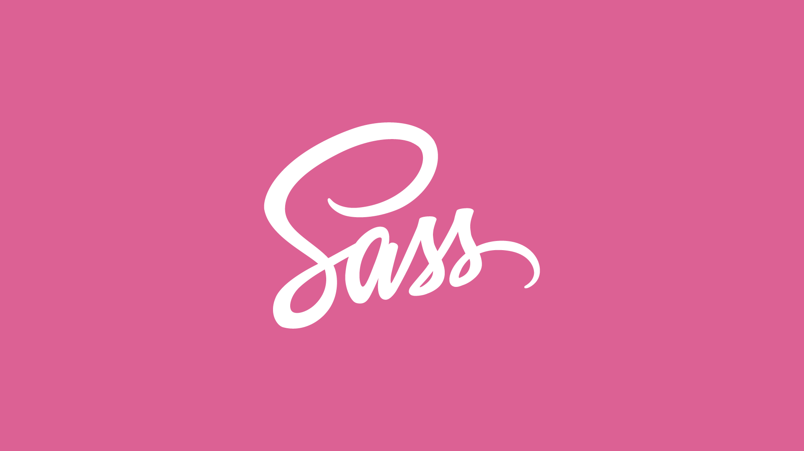

Hoje irei te mostrar como escrever CSS de forma mais fácil e organizada. Hoje vamos conhecer o SASS, um pré-processador. Pega o café porque esse post vai ter muito conteúdo!


<hr />

### Pré-processador?

Já que vamos falar sobre um pré-processador de CSS, nada mais justo te explicar o que é e como funciona um, concorda?

Falando de forma resumida, um pré-processador é como se você estivesse programando em uma linguagem de programação. Você vai escrever de um jeito e então o pré-processador vai te dar o resultado no CSS puro.

**OBS: Nesse post eu não ensino como instalar o SASS. Caso você queira aprender a como instalar, recomendo dar uma conferida [no próprio site do SASS](https://sass-lang.com/install).*

*Recomendo que você adquira um conhecimento com JavaScript, pois se eu for explicar o que é uma variavél, por exemplo, o post vai ficar enorme.*


Dá uma conferida no código abaixo: 


    <!-- Código em SASS  -->
    $amarelo: #f0a500;    <- Isso é uma variável. Nas seções abaixo te explico melhor.
    $roxo: #675cff;     <- Isso também é uma variável :) 

    header {
      position: fixed;
      top: 0;
      z-index: 5;
      width: 100vw;
      background-color: $amarelo;

      a {
        color: $roxo;
        text-decoration: none;
        transition: transform .3s ease;
      
      &:hover {
        transform: scale(1.1)
        }
      }
      
    }


    <!-- O mesmo código acima, agora com CSS -->
    header {
      height: 100vh;
      width: 100vw;
      background-color: #f0a500;
    }
    header a {
      color: #675cff;
      text-decoration: none;
      transition: transform 0.3s ease;
    }
    header a:hover {
      transform: scale(1.1);
    }


*Se você nunca usou SASS antes, você deve ter ficado meio perdido, mas fica tranquilo que irei te explicar e te garanto que quando terminar de ler esse post você já vai estar sabendo bem de SASS :)*

Viu como fica mais organizado? Podemos aninhar nosso código um dentro do outro. Exemplo do código acima: a gente pôde  estilizar uma âncora que está dentro do "header", e dentro dessa âncora estilizamos o :hover. Legal né?

### O que é SASS

SASS é um pré-processador de CSS. O diferencial do SASS e dos outros pré-processadores, é que, como citei anteriormente, a gente escreve de forma bem mais fácil e organizada comparada com a forma em que escrevemos com CSS puro. 

Como eu disse lá em cima, um pré-processador é como se você estivesse programando em uma linguagem de programação, e é isso o que o SASS faz. O SAAS adiciona capacidades de uma linguagem de programação (você irá ver melhor nas seções abaixo).

Quando escrevemos com SASS, não precisamos escrever SASS e CSS. Uma vez que escrevemos em SASS, o arquivo .scss é pré-processado e, aí sim, é gerado um arquivo .css.

*<strong>Mas por que é gerado um arquivo .css se já estamos escrevendo em .scss?</strong>* 🤔

A resposta é bem simples: o navegador não consegue ler arquivos .scss, mas sim .css. E afinal, um arquivo .scss ainda continua sendo uma folha de estilo. Além disso, temos a opção de [minificar](https://www.mundojs.com.br/2018/01/10/o-que-e-minificacao/) o código .css final. Ficaria algo assim:

    header{height: 100vh; width: 100vw; background-color: #f0a500;}header a{color: #675cff; text-decoration: none; transition: transform 0.3s ease;}header a:hover{transform: scale(1.1);}


### Módulos / Import
Caso você não saiba, podemos importar arquivos .css em um único arquivo .css, isso pode nos ajudar e evitar menos bagunça na hora de estilizar. Por exemplo:

    @import 'resets.css';
    @import 'responsive.css';

  Nessas duas linhas estamos importando de outros arquivos .css os trechos de códigos presentes em tais. Entretanto, quando utilizamos dessa forma com arquivos .css estamos carregando mais de um arquivo .css, ou seja, se você tiver dois imports, você está carregando mais dois arquivos .css para seu site (sendo que o ideial é apenas um arquivo).

  Mas no SASS, quando fazemos os imports, não estamos importando direto no navegador, apenas na compilação, e no arquivo final será gerado apenas o que tiver nos imports. Veja o exemplo abaixo.

    @import 'resets.scss';
    @import 'responsive.scss';
    @import 'colors.scss';
    @import 'dark-mode.scss';
    @import 'animations.scss';
    
Dica: Quando importamos "resets.scss", ele vai gerar um arquivo .css. Para impedir isso, basta colocar um underline antes do nome do arquivo. Chamamos isso de [partials](https://riptutorial.com/sass/example/14566/partials). Então fica assim:

    @import '_resets.scss';
    @import '_responsive.scss';
    @import '_colors.scss';
    @import '_dark-mode.scss';
    @import '_animations.scss';

### Variáveis
Imagina que você tem um código de mais de três mil linhas e você precisa alterar uma cor. Muita gente acaba indo em cada classe que tem a cor e altera a mesma pelo valor desejado. Mas essa não é a melhor forma. Já pensou se tivesse como você alterar apenas uma parte e toda a cor do site muda? com o SASS isso é possível usando as variavéis.

Uma variável com SASS é declarada com o seguinte padrão: ```$nome-variavel: valor```, onde: "nome-variavel" é o nome da sua variável, e "valor" é o valor que você desejar. Por exemplo:

    $color-bg: #fff;  
    $color-text: #000;

    <!-- Não necessariamente precisa ser com valores hexadecimal, podemos utilizar com px, por exemplo. -->

    $outside-space: 10px;
    $font-primary: 16px

Agora que temos as variáveis, já podemos usá-las. Confira alguns exemplos:

    section {
      margin: $outside-space;
      background-color: $color-bg;
    }

    a {
      font-size: $font-primary;
      color: $color-text;
    }

    <!-- Não há limites para uso de variavéis. Você pode utilizar a mesma variavél em diversas class. -->


### Nesting
Quando eu coloquei o código na seção onde eu explicava do que se tratava um pré-processador, imagino que você tenha ficado meio confuso. Naquele código eu apliquei um exemplo bem comum com o uso de SASS que é com o Nesting(ou traduzindo: "aninhamento").

Nesting é o aninhamento de seletores dentro de outros seletores. Para você entender melhor, vou explicar o código que exemplifiquei no começo.


    ...

    header {   <!-- Pegamos do HTML o header -->
      position: fixed;
      top: 0;
      z-index: 5;
      width: 100vw;
      background-color: $amarelo;


      <!-- Pegamos a âncora que estiver dentro do header -->
      a {
        color: $roxo;
        text-decoration: none;
        transition: transform .3s ease;
      
      <!-- E sobre a âncora estilizamos o hover da mesma -->
      &:hover {
        transform: scale(1.1)
        }
      }

      ...

### & Nesting
Você deve estar se perguntando sobre do que se trata o ```&``` que eu inseri antes do ```:hover```. É bem simples de entender: você vai utilizar o ```&``` quando você quiser que "grude" no elemento anterior. Veja como ficaria com CSS puro: 

    a {
      color: #675cff;
      text-decoration: none;
      transition: transform 0.3s ease;
    }
    a:hover {
      transform: scale(1.1);
    }
Um outro exemplo que podemos conferir é quando clicamos em um ```input``` e ele aplica aquele efeito de foco. Veja como ficaria o nesting: 

    <!-- Com SASS -->
    input {
      background-color: $color-bg;
      padding: $outside-space;
      transition: background-color .3s ease;

      &:focus {
        background-color: $roxo;
      }
    }

    <!-- Com CSS -->
    input {
      background-color: #fff;
      padding: 10px;
      transition: background-color 0.3s ease;
    }
    input:focus {
      background-color: #675cff;
    }

Interessante né?

### Conclusão
Esse post ficou meio grande, mas eu gostei bastante de escrevê-lo. Já fazia um bom tempo em que eu queria escrever sobre o SASS e mostrar o poder desse pré-processador, então hoje resolvi tirar um tempo para escrever, espero que você tenha entendido bem. 

Dito tudo isso, muitas pessoas ainda me perguntam se realmente vale a pena utilizar o SASS e na <strong>minha opinião</strong> vale sim. Além de te ajudar a desenvolver, conhecimento nunca é demais rs. E lembre-se: SASS ainda é uma folha de estilo, com uma "Sintaxe Espetacular".

Isso é tudo, pessoal.

*Referências: https://sass-lang.com/documentation, https://sass-lang.com/guide, https://www.mundojs.com.br/2018/01/10/o-que-e-minificacao/, https://blog.revelo.com.br/diferenca-entra-css-e-sass/*
